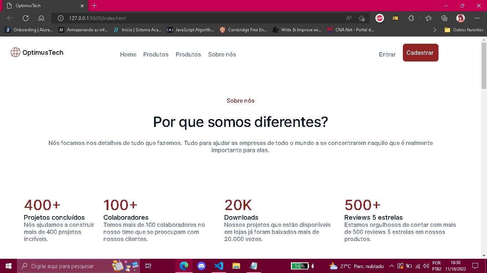
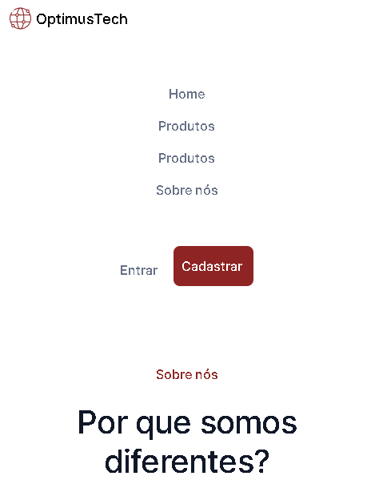

This is a solution to the Interactive landing page challenge from Alura.

## Table of contents

- [Overview](#overview)
  - The challenge is to build out this interactive the landing page of the company Optimus Tech and get it looking as close to the design as possible.
  - 
  - [Links](#links) Deploy: https://natsmarinho.github.io/optimus-tech/
- My process: It took me 5 days to build this.
  - Built with: HTML5 and CSS3.
  - What I learned: I've learned how to use display block, position: absolute and relative, display block-inline in one <section> and nth-child. And also I've learned more how to built a responsive page.
  - Continued development: I have to continue practice how to make the responsive page. 
- Author: Natali Marinho. 
- Acknowledgments: html and css .


### The challenge

Users should be able to:

- View the optimal layout for the app depending on their device's screen size

### Screenshot





## My process

### Built with

- Semantic HTML5 markup
- CSS custom properties
- Flexbox
- Mobile-first workflow


### What I learned


```css
.btn-login a:nth-child(1);

.btn-login a:nth-child(2);

position: absolute;

@media screen and;
```
### Continued development

I want to learn more about responsive pages and more about javascript. 

## Author

- Frontend Mentor - [@natsmarinho](https://www.frontendmentor.io/profile/natsmarinho)
- Twitter - [@natsmarinho](https://www.twitter.com/natsmarinho)
- Instagram - [@natsmarinho](https://www.instagram.com/natsmarinho/)

## Acknowledgments

I want to thank my friends Marcela, Nick, Guilherme and Jessica for believing in me and always chear me up to continue study to become a developer. 
